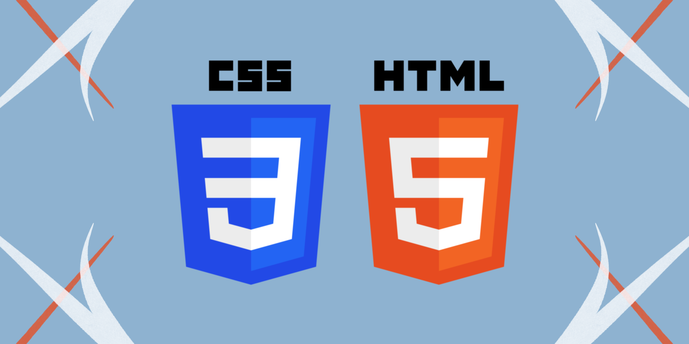

### Salutare! ✋
Salut, eu sunt Mihai Nartea, student la Universitatea de Stat din Moldova, facultatea de matematica si informatica, la specialitatea informatica aplicata.

La moment fac niste cursuri de FrontEnd Developer la StepIT.

Limbajele care le cunosc la moment sunt `HTML`, `CSS`.

Limbajele care le invat la moment sunt JavaScript.

Doresc sa invat un framework cum ar fi Angular.

Ma puteti contacta pe email: narteamihai222@gmail.com

